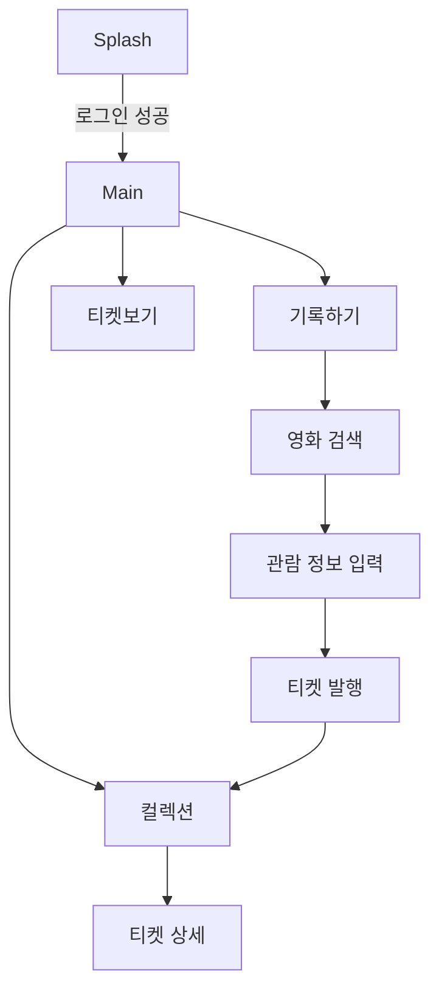
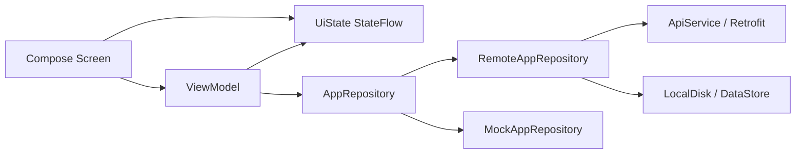

# Filmo

## 10th NE(O)RDINARY HACKATHON 우수상

독립영화의 모든 순간을 기록하는 서비스, Filmo의 Android 클라이언트입니다.

해커톤 MVP 기준으로는 로그인, 영화 검색, 관람 정보 입력, 티켓 발행, 내 컬렉션, 공개 티켓 피드가 중심 기능입니다.

## 프로젝트 개요

| 항목 | 내용 |
| --- | --- |
| 서비스명 | Filmo |
| 주제 | 독립영화 공유 플랫폼 |
| 문제 상황 | 비주류 독립영화 취향을 기록하고 공유할 수 있는 수집형 플랫폼이 부족함 |
| 사용자 | 독립영화를 좋아하고, 본 영화를 티켓처럼 모아 공유하고 싶은 사람 |
| 핵심 가치 | 감상 기록을 티켓 형태로 바꿔 수집의 재미를 만들고, 다른 사용자의 독립영화 취향을 탐색하게 함 |

## 핵심 기능

| 기능 | 설명 |
| --- | --- |
| 로그인 | 아이디/비밀번호 로그인, access token DataStore 저장 |
| 영화 검색 | 서버 영화 목록 조회, 검색어 debounce, 페이지네이션 |
| 영화 상세 정보 | 선택한 영화의 감독, 장르, 제작연도, 러닝타임, 포스터 정보 조회 |
| 관람 기록 입력 | 관람일, 별점, 관람 후기 입력 |
| 티켓 발행 | 관람 기록을 티켓 UI로 미리 보고 서버에 생성, 생성 후 공개 상태로 전환 |
| 컬렉션 | 내 티켓 목록을 포스터 기반 티켓 카드 그리드로 표시 |
| 티켓 상세 | 선택한 티켓의 포스터, 영화 메타데이터, 별점, 관람일, 후기를 티켓 형태로 표시 |
| 공개 티켓 피드 | 다른 사용자가 공개한 티켓 목록 조회 |
| 좋아요 | 공개 티켓과 티켓 상세에서 좋아요 토글, 본인 티켓 좋아요 제한 메시지 처리 |

## 화면 흐름



## 주요 화면

| 항목 | 내용 |
| --- | --- |
| |  |
| 컬렉션 | 티켓 보기 |
|  |  |
| 기록하기 - 영화 검색 | 기록하기 - 관람 정보 입력 |
|  | |
| 티켓 발행 | |

## 기술 스택

- Kotlin
- Jetpack Compose
- MVVM
- Coroutines
- Navigation 3
- Hilt
- Retrofit
- OkHttp
- DataStore
- Coil 3
- Timber

## 아키텍처



- 화면은 `UiState`를 구독하고 이벤트를 ViewModel 함수로 전달합니다.
- ViewModel은 repository 호출 결과를 `StateFlow`로 노출합니다.
- `AppRepository` 인터페이스 뒤에 원격 구현과 mock 구현이 분리되어 있습니다.
- `BuildConfig.USE_MOCK_REPOSITORY` 값으로 repository 구현을 선택합니다.
- token은 `LocalDisk`가 DataStore에 저장하고, OkHttp interceptor가 `Authorization: Bearer` 헤더에 붙입니다.

## 디렉터리 구조

```text
filmo/
├─ app/
│  ├─ src/main/java/com/filmo/
│  │  ├─ FilmoApplication.kt
│  │  ├─ service/
│  │  │  ├─ ApiService.kt
│  │  │  ├─ AppRepository.kt
│  │  │  ├─ RemoteAppRepository.kt
│  │  │  ├─ MockAppRepository.kt
│  │  │  ├─ RepositoryModule.kt
│  │  │  ├─ NetworkModule.kt
│  │  │  └─ LocalDisk.kt
│  │  └─ ui/
│  │     ├─ main/
│  │     ├─ setup/
│  │     ├─ movie/
│  │     ├─ collection/
│  │     ├─ ticket/
│  │     ├─ component/
│  │     └─ theme/
│  ├─ src/test/java/com/filmo/
│  └─ build.gradle.kts
├─ gradle/libs.versions.toml
├─ AGENTS.md
└─ README.md
```

## 서버 연동

기본 API 서버는 `app/build.gradle.kts`의 `BuildConfig.API_BASE_URL`에 정의되어 있습니다.

```kotlin
buildConfigField("String", "API_BASE_URL", "\"https://filmo-api.log8.kr/\"")
buildConfigField("Boolean", "USE_MOCK_REPOSITORY", "false")
```

현재 사용하는 주요 API:

| 기능 | Method / Path |
| --- | --- |
| health check | `GET /health` |
| 회원가입 | `POST /api/auth/signup` |
| 로그인 | `POST /api/auth/login` |
| 영화 목록 | `GET /api/movies` |
| 영화 상세 | `GET /api/movies/{seq}` |
| 영화 포스터 | `GET /api/movies/image/{imagePath}` |
| 내 티켓 목록 | `GET /api/tickets` |
| 내 티켓 상세 | `GET /api/tickets/{ticketId}` |
| 공개 티켓 목록 | `GET /api/tickets/public` |
| 티켓 생성 | `POST /api/tickets` |
| 티켓 공개 전환 | `PATCH /api/tickets/{ticketId}/share` |
| 좋아요 추가/삭제 | `POST /api/likes/{ticketId}`, `DELETE /api/likes/{ticketId}` |
| 티켓 수정/삭제 | `PATCH /api/tickets/{ticketId}`, `DELETE /api/tickets/{ticketId}` |
| 저장한 컬렉션 | `GET /api/collections`, `GET /api/collections/{ticketId}`, `DELETE /api/collections/{ticketId}` |

## Backend
- [@ohujj](https://github.com/ohujj)
- [@IISweetHeartII](https://github.com/IISweetHeartII)
- [https://github.com/ohujj/CMC-Hackathon](https://github.com/ohujj/CMC-Hackathon)

## iOS
- [@yundal8755](https://github.com/yundal8755)
- [https://github.com/yundal8755/Filmo](https://github.com/yundal8755/Filmo)
