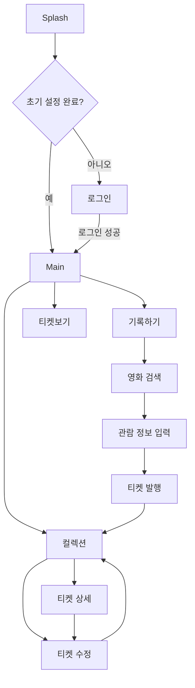
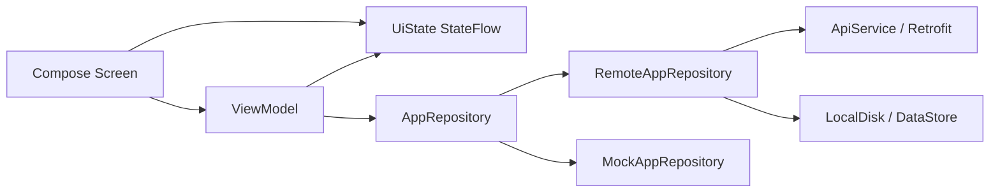

# Filmo

독립영화를 보고 남긴 감상 기록을 영화 티켓 형태로 수집하고, 다른 사람의 취향까지 둘러볼 수 있는 Android 앱입니다.

해커톤 MVP 기준으로는 로그인, 영화 검색, 관람 정보 입력, 티켓 발행, 내 컬렉션, 공개 티켓 피드가 중심 기능입니다.

## 프로젝트 개요

| 항목 | 내용 |
| --- | --- |
| 서비스명 | Filmo |
| 주제 | 독립영화 공유 플랫폼 |
| 문제 상황 | 비주류 독립영화 취향을 기록하고 공유할 수 있는 수집형 플랫폼이 부족함 |
| 사용자 | 독립영화를 좋아하고, 본 영화를 티켓처럼 모아 공유하고 싶은 사람 |
| 핵심 가치 | 감상 기록을 티켓 형태로 바꿔 수집의 재미를 만들고, 다른 사용자의 독립영화 취향을 탐색하게 함 |

## 핵심 기능

| 기능 | 현재 구현 상태 |
| --- | --- |
| 로그인 | 아이디/비밀번호 로그인, access token DataStore 저장 |
| 영화 검색 | 서버 영화 목록 조회, 검색어 debounce, 페이지네이션 |
| 영화 상세 정보 | 선택한 영화의 감독, 장르, 제작연도, 러닝타임, 포스터 정보 조회 |
| 관람 기록 입력 | 관람일, 별점, 관람 후기 입력 |
| 티켓 발행 | 관람 기록을 티켓 UI로 미리 보고 서버에 생성, 생성 후 공개 상태로 전환 |
| 컬렉션 | 내 티켓 목록을 포스터 기반 티켓 카드 그리드로 표시 |
| 티켓 상세 | 선택한 티켓의 포스터, 영화 메타데이터, 별점, 관람일, 후기를 티켓 형태로 표시 |
| 티켓 수정 | 수정 화면과 저장 로직이 존재함. 현재 컬렉션에서 수정 화면으로 들어가는 UX는 정리 필요 |
| 공개 티켓 피드 | 다른 사용자가 공개한 티켓 목록 조회 |
| 좋아요 | 공개 티켓과 티켓 상세에서 좋아요 토글, 본인 티켓 좋아요 제한 메시지 처리 |
| 영화관 추천 | 해커톤 기획상 확장 기능. 현재 코드에는 독립영화관 추천 화면은 아직 없음 |

## 화면 흐름



## 주요 화면

### Splash / 로그인

- 앱 시작 시 `DataStore`에 저장된 초기 설정 완료 여부를 확인합니다.
- 로그인 화면에서는 아이디와 비밀번호를 입력합니다.
- 각 입력값은 4자 이상이어야 로그인 버튼이 활성화됩니다.
- 로그인 성공 시 access token을 저장하고 메인 화면으로 이동합니다.

관련 파일:
- `app/src/main/java/com/filmo/ui/main/MainActivity.kt`
- `app/src/main/java/com/filmo/ui/setup/SplashScreen.kt`
- `app/src/main/java/com/filmo/ui/setup/InitialSetupScreen.kt`
- `app/src/main/java/com/filmo/ui/setup/AuthFormScreen.kt`

### 컬렉션

- 앱의 기본 시작 탭입니다.
- 내가 만든 티켓을 2열 그리드로 보여줍니다.
- 각 티켓은 포스터 이미지, 제목, 별점, 관람일을 포함합니다.
- 로딩, 빈 상태, 에러 상태, retry action이 구현되어 있습니다.

관련 파일:
- `app/src/main/java/com/filmo/ui/collection/CollectionScreen.kt`
- `app/src/main/java/com/filmo/ui/collection/CollectionViewModel.kt`
- `app/src/main/java/com/filmo/ui/collection/CollectionTicketComponents.kt`

### 기록하기

- 영화 목록을 서버에서 가져오고, 제목/감독명 기반 검색을 지원합니다.
- 검색 입력은 250ms debounce 후 서버에 요청합니다.
- 목록은 3열 포스터 그리드로 보여주며, 하단 접근 시 다음 페이지를 불러옵니다.
- 영화를 선택하면 관람 정보 입력 화면으로 이동합니다.

관련 파일:
- `app/src/main/java/com/filmo/ui/movie/RegisterMovieScreen.kt`
- `app/src/main/java/com/filmo/ui/movie/MovieSearchStepScreen.kt`
- `app/src/main/java/com/filmo/ui/movie/RegisterMovieViewModel.kt`

### 관람 정보 입력

- 선택한 영화의 포스터와 메타데이터를 보여줍니다.
- 관람일은 wheel date picker bottom sheet로 선택합니다.
- 별점은 1~5점, 관람 후기는 최대 100자까지 입력합니다.
- 필수값이 비어 있으면 사용자에게 복구 가능한 에러 메시지를 보여줍니다.

관련 파일:
- `app/src/main/java/com/filmo/ui/movie/ViewingInfoScreen.kt`
- `app/src/main/java/com/filmo/ui/movie/MovieInfoStepScreen.kt`
- `app/src/main/java/com/filmo/ui/movie/WheelDatePickerSheet.kt`

### 티켓 발행

- 입력한 관람 기록을 실제 티켓처럼 보이는 UI로 미리 보여줍니다.
- 티켓은 포스터 영역, 점선 절취선, 별점/관람일/후기 영역으로 구성됩니다.
- 티켓 발행 단계 진입 시 서버에 티켓을 생성하고 공개 상태로 갱신합니다.

관련 파일:
- `app/src/main/java/com/filmo/ui/movie/TicketShareStepScreen.kt`
- `app/src/main/java/com/filmo/ui/movie/ViewingInfoScreen.kt`

### 티켓보기

- 공개된 티켓을 세로 리스트로 보여주는 공유 피드입니다.
- 각 티켓은 포스터, 영화 메타데이터, 별점, 관람일, 후기, 좋아요 버튼을 포함합니다.
- 로딩, 빈 상태, 에러 상태, retry action이 구현되어 있습니다.

관련 파일:
- `app/src/main/java/com/filmo/ui/ticket/TicketViewScreen.kt`
- `app/src/main/java/com/filmo/ui/ticket/TicketViewModel.kt`

## 기술 스택

| 영역 | 사용 기술 |
| --- | --- |
| Language | Kotlin |
| UI | Jetpack Compose, Material 3 |
| Architecture | MVVM, 단방향 데이터 흐름 |
| State | StateFlow, collectAsStateWithLifecycle |
| Async | Kotlin Coroutines |
| Navigation | AndroidX Navigation 3 `NavDisplay`, `NavKey` |
| DI | Hilt |
| Network | Retrofit, OkHttp |
| JSON | Kotlinx Serialization JSON |
| Persistence | DataStore Preferences |
| Image | Coil 3, memory/disk cache |
| Logging | Timber |
| Test | JUnit4, Compose UI test dependency |
| Build | Gradle Kotlin DSL, Android Gradle Plugin |

## 아키텍처



- 화면은 `UiState`를 구독하고 이벤트를 ViewModel 함수로 전달합니다.
- ViewModel은 repository 호출 결과를 `StateFlow`로 노출합니다.
- `AppRepository` 인터페이스 뒤에 원격 구현과 mock 구현이 분리되어 있습니다.
- `BuildConfig.USE_MOCK_REPOSITORY` 값으로 repository 구현을 선택합니다.
- token은 `LocalDisk`가 DataStore에 저장하고, OkHttp interceptor가 `Authorization: Bearer` 헤더에 붙입니다.

## 디렉터리 구조

```text
filmo/
├─ app/
│  ├─ src/main/java/com/filmo/
│  │  ├─ FilmoApplication.kt
│  │  ├─ service/
│  │  │  ├─ ApiService.kt
│  │  │  ├─ AppRepository.kt
│  │  │  ├─ RemoteAppRepository.kt
│  │  │  ├─ MockAppRepository.kt
│  │  │  ├─ RepositoryModule.kt
│  │  │  ├─ NetworkModule.kt
│  │  │  └─ LocalDisk.kt
│  │  └─ ui/
│  │     ├─ main/
│  │     ├─ setup/
│  │     ├─ movie/
│  │     ├─ collection/
│  │     ├─ ticket/
│  │     ├─ component/
│  │     └─ theme/
│  ├─ src/test/java/com/filmo/
│  └─ build.gradle.kts
├─ gradle/libs.versions.toml
├─ AGENTS.md
└─ README.md
```

## 서버 연동

기본 API 서버는 `app/build.gradle.kts`의 `BuildConfig.API_BASE_URL`에 정의되어 있습니다.

```kotlin
buildConfigField("String", "API_BASE_URL", "\"https://filmo-api.log8.kr/\"")
buildConfigField("Boolean", "USE_MOCK_REPOSITORY", "false")
```

현재 사용하는 주요 API:

| 기능 | Method / Path |
| --- | --- |
| health check | `GET /health` |
| 회원가입 | `POST /api/auth/signup` |
| 로그인 | `POST /api/auth/login` |
| 랜덤 닉네임 | `GET /api/auth/nickname/random` |
| 영화 목록 | `GET /api/movies` |
| 영화 상세 | `GET /api/movies/{seq}` |
| 영화 포스터 | `GET /api/movies/image/{imagePath}` |
| 내 티켓 목록 | `GET /api/tickets` |
| 내 티켓 상세 | `GET /api/tickets/{ticketId}` |
| 공개 티켓 목록 | `GET /api/tickets/public` |
| 티켓 생성 | `POST /api/tickets` |
| 티켓 공개 전환 | `PATCH /api/tickets/{ticketId}/share` |
| 좋아요 추가/삭제 | `POST /api/likes/{ticketId}`, `DELETE /api/likes/{ticketId}` |
| 티켓 수정/삭제 | `PATCH /api/tickets/{ticketId}`, `DELETE /api/tickets/{ticketId}` |
| 저장한 컬렉션 | `GET /api/collections`, `GET /api/collections/{ticketId}`, `DELETE /api/collections/{ticketId}` |

## 실행 및 빌드

Android Studio에서 열어 실행하는 것을 기본으로 합니다.

필요할 때 debug APK만 확인합니다.

```powershell
$env:GRADLE_USER_HOME="C:\Users\ddddd\.gradle"; .\gradlew.bat assembleDebug --offline
```

offline 캐시가 부족해서 실패하면 코드 문제로 단정하지 않고 Gradle 캐시 부족으로 봅니다.

## 테스트

현재 `app/src/test` 아래에 ViewModel, navigation helper, theme token, 날짜 선택, repository 테스트가 포함되어 있습니다.

예시:

- `TicketViewModelTest`
- `CollectionViewModelTest`
- `RegisterMovieViewModelTest`
- `MainBottomBarVisibilityTest`
- `RemoteAppRepositoryTest`

## 현재 MVP 범위와 남은 확장

현재 앱은 "독립영화 감상 기록을 티켓으로 만들고 공유한다"는 핵심 플로우에 집중되어 있습니다.

남은 확장 후보:

- 독립영화관 장소 추천 화면
- 영화관 후기 및 별점 모아보기
- 저장한 티켓 탭 UI 노출
- 티켓 삭제/수정 진입 UX 정리
- 티켓 생성 시 영화관 입력값 연동
- 티켓 이미지 저장 또는 공유 기능
- 회원가입/랜덤 닉네임 플로우 재활성화

## 한 줄 소개

Filmo는 독립영화 감상 경험을 포스터가 담긴 티켓으로 기록하고, 같은 취향의 사람들이 공개 티켓을 통해 서로의 영화 취향을 발견하도록 돕는 앱입니다.
